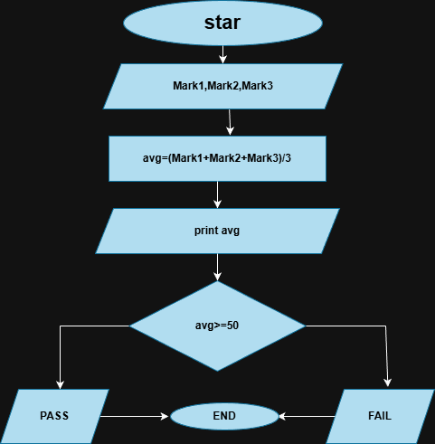

# Student Performance Tracker | Öğrenci Performans Takip Sistemi 🎓

### Description | Açıklama:
**EN:** This project is a Java-based application that calculates total marks, the average score, and determines the final academic status (Pass/Fail).  
**TR:** Bu proje, toplam puanı ve ortalamayı hesaplayan, ardından akademik başarı durumunu (Geçti/Kaldı) belirleyen Java tabanlı bir uygulamadır.

---

## 📊 Flowchart | Akış Diyagramı


---

## 💻 Java Code | Java Kodu
**EN:** Below is the implementation of the logic shown in the flowchart:  
**TR:** Aşağıda, akış diyagramında gösterilen mantığın kodlanmış hali yer almaktadır:

```java

import java.util.Scanner;
public class Main {
    public static void main(String[] args){
        Scanner s1 = new Scanner(System.in);
        double mark1, mark2, mark3;

        System.out.println("Enter your marks:");
        mark1= s1.nextDouble();
        mark2= s1.nextDouble();
        mark3= s1.nextDouble();

        double avg = (double) (mark1 + mark2 + mark3)/3;

        if(avg >= 50){
            System.out.println("PASS");
        }else{
            System.out.println("FAIL");
        }

    }
}
